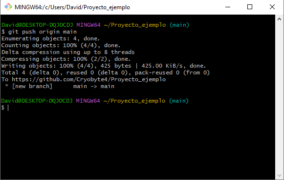

# Actividad Javadoc

En esta actividad, cada grupo deberá elegir una de las siguientes situaciones relacionadas con Git y documentar detalladamente todos los pasos necesarios para resolverla. Además, se debe utilizar lenguaje Markdown para la documentación y proporcionar capturas de pantalla cuando sea necesario. Al final, se compartirán todos los documentos creados por los compañeros para que cada grupo pueda aprender de las diferentes soluciones.


- [Introducción de Git](#introducción-de-git)
    * [Características de Git](#características-de-git)
    * [Comandos de Git](#comandos-de-git)
- [Guía básica de uso de Git](#guía-básica-de-uso-de-git)
    * [Clonar un repositorio](#clonar-un-repositorio)
    * [Inicializar un repositorio](#inicializar-un-repositorio)
    * [Añadir cambios al área de preparación](#añadir-cambios-al-área-de-preparación)
    * [Confirmar cambios](#confirmar-cambios)
    * [Enlazar con un repositorio remoto](#enlazar-con-un-repositorio-remoto)
    * [Subir cambios al repositorio remoto](#subir-cambios-al-repositorio-remoto)
- [Situación de Git](#situación-de-git)
    * [Caso 1: Cambiar el mensaje de una confirmación](#caso-1-cambiar-el-mensaje-de-una-confirmación)
    * [Caso 2: Crear y fusionar ramas en un repositorio Git](#caso-2-crear-y-fusionar-ramas-en-un-repositorio-git)


---


## Introducción de Git

Git es un sistema de control de versiones distribuido ampliamente utilizado para el seguimiento de cambios en archivos de código fuente durante el desarrollo de software. Fue creado por Linus Torvalds en 2005 debido a que la herramienta BitKeeper (utilizada en el control de versiones del kernel de Linux), dejó de ser ofrecida de manera gratuita.


### Características de Git

- **Distribuido**: Cada desarrollador tiene una copia completa del repositorio, lo que permite trabajar de forma independiente sin necesidad de una conexión constante a un servidor central.
- **Ramificación eficiente**: Permite la creación y gestión de ramas de forma sencilla, lo que facilita el trabajo paralelo en diferentes características o correcciones de errores.
- **Integridad de los datos**: Utiliza un sistema de hash criptográfico para asegurar la integridad de los datos en el repositorio. Cada cambio realizado se registra de manera única, lo que dificulta perder información de manera accidental o deliberada.


### Comandos de Git

| Comando       | Descripción                                                                                     | Ejemplo de uso                                       |
|---------------|-------------------------------------------------------------------------------------------------|------------------------------------------------------|
| **git init**      | Inicializa un nuevo repositorio Git en un directorio local.                                 | `git init`                                           |
| **git clone**     | Clona un repositorio Git existente desde un servidor remoto.                                | `git clone https://github.com/usuario/proyecto.git`  |
| **git add**       | Agrega cambios al área de preparación antes de confirmarlos.                                | `git add archivo.txt`                                |
| **git commit**    | Confirma los cambios agregados al área de preparación.                                        | `git commit -m "Mensaje del cambio"`                 |
| **git status**    | Muestra el estado actual del repositorio.                                                   | `git status`                                         |
| **git remote**      | Muestra los repositorios remotos vinculados al repositorio local.                  | `git remote`                                        |
| **git remote add**      | Agrega un nuevo repositorio remoto bajo un nombre específico.                      | `git remote add origin https://github.com/ejemplo/proyecto.git` |
| **git remote remove**   | Elimina un repositorio remoto vinculado al repositorio local.                            | `git remote remove origin`                          |
| **git push**            | Sube los commits locales a un repositorio remoto.                                                 | `git push origin master`                             |
| **git pull**            | Obtiene los cambios más recientes del repositorio remoto y los fusiona con la rama local actual. | `git pull origin master`                             |
| **git branch**          | Lista, crea, renombra y elimina ramas en el repositorio.                                         | `git branch nueva_rama`                              |
| **git merge**           | Fusiona los cambios de una rama en otra.                                                          | `git merge nueva_rama`                               |
| **git checkout**        | Cambia entre ramas, restaura archivos y deshace cambios locales.                                  | `git checkout nueva_rama`                            |

---

## Guía básica de uso de Git

Esta guía explica el proceso de creación de un repositorio desde cero. Las imágenes muestran un caso de uso real de los comandos y sus resultados.


### Clonar un repositorio

En caso de trabajar con un repositorio ya creado, se clona el repositorio remoto al equipo para trabajar con un repositorio local.

```bash
git clone "url_del_repositorio"
```


### Inicializar un repositorio

En caso de querer iniciar un proyecto nuevo, se debe acceder a la carpeta del proyecto e inicializarlo:

```bash
cd "Ruta_del_repositorio"       # Se accede a la carpeta del repositorio
git init                        # Se inicializa el repositorio
```


### Añadir cambios al área de preparación

Se realizan los cambios en el proyecto (añadir, modificar o eliminar archivos) y se añaden al área de preparación. Se pueden añadir archivos específicos o todos los archivos modificados en el directorio de trabajo:

```bash
git add <nombre_del_archivo>    # Añadir un archivo específico
git add .                       # Añadir todos los archivos modificados
```


### Confirmar cambios

Una vez se han agregado los cambios al área de preparación, se pueden confirmar con un mensaje descriptivo:

```bash
git commit -m "Mensaje del commit"
```


### Crear una rama principal

Al crear un repositorio, se puede crear una rama principal (main) que servirá como la rama base desde la cual se bifurcarán todas las otras ramas de desarrollo y características.
```bash
git branch -M main      # Crea una rama principal llamada "main"
git branch desarrollo   # Crea una rama llamada "desarrollo"
```


### Enlazar con un repositorio remoto

Un repositorio local puede ser enlazado con un repositorio remoto existente, para que los cambios sean aplicados:

```bash
git remote add origin "URL_del_proyecto"
```


### Subir cambios al repositorio remoto

Una vez se han realizado todas las confirmaciones necesarias, se aplican los cambios realizados al repositorio remoto. Especifica la rama local que deseas subir y la rama correspondiente en el repositorio remoto (por lo general, main o master):

```bash
git push -u origin <nombre_de_la_rama_local> <nombre_de_la_rama_remota>     # Se suben los cambios de la rama local mencionada a la rama remota
git push -u origin <nombre_de_la_rama_remota>                               # Se suben los cambios de la rama local actual a la rama remota
```



---


## Situación de Git


### Caso 1: Cambiar el mensaje de una confirmación

A veces, se cometen errores tipográficos o se desea clarificar el mensaje de un commit anterior. Git proporciona una forma de cambiar el mensaje de confirmación de un commit anterior utilizando el comando git commit --amend.


#### Pasos a seguir:

1. Utilizar **git commit --amend** seguido del flag -m y el nuevo mensaje que se desea para el commit.

```bash
git commit --amend -m "Nuevo mensaje del commit"
```


### Caso 2: Crear y fusionar ramas en un repositorio Git

Crear y fusionar ramas es una práctica común en el desarrollo de software con Git. Las ramas permiten trabajar en nuevas características o correcciones de errores de forma aislada, sin afectar la rama principal del proyecto. Una vez completadas, las ramas pueden fusionarse de nuevo en la rama principal para integrar los cambios en el proyecto.


#### Pasos a seguir:

1. **Crear una nueva rama:** Utilizar el comando **git branch** seguido del nombre de la nueva rama que se desea crear.
```bash
git branch nueva_rama
```


2. **Cambiar a la nueva rama:** Utilizar el comando **git checkout** seguido del nombre de la nueva rama para cambiar a esa rama.
```bash
git checkout nueva_rama
```


3. **Añadir y confirmar cambios:** Utilizar los comandos **git add** y **git commit** para agregar y confirmar los cambios en la nueva rama.
```bash
git add .
git commit -m "Mensaje descriptivo del commit en la nueva rama"
```


4. **Cambiar de nuevo a la rama principal:** Se utiliza el comando **git checkout** seguido del nombre de la rama principal para cambiar de nuevo a esa rama.
```bash
git checkout main
```


5. **Fusionar la nueva rama con la rama principal:** Se utiliza el comando **git merge** seguido del nombre de la rama que se desea fusionar con la rama principal.
```bash
git merge nueva_rama
```


6. **Eliminar la rama (opcional):** Una vez que se haya fusionado la nueva rama con éxito, se puede eliminar si ya no se necesita, utilizando el comando **git branch -d**.
```bash
git branch -d nueva_rama
```


